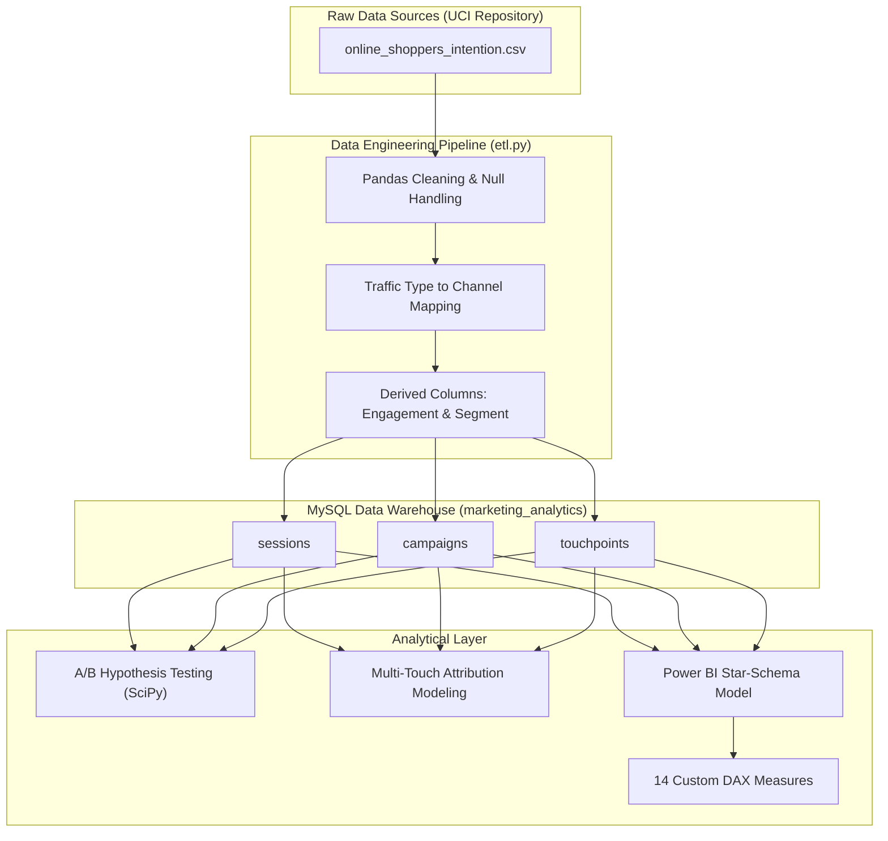

# Digital Marketing Campaign Performance & Channel Attribution Analysis

An enterprise-grade marketing analytics platform built from scratch to clean, model, analyze, and forecast campaign ROAS and attribution models, leveraging real-world e-commerce interactions.

This project implements a Python ETL pipeline, a MySQL data warehouse (Star Schema), statistical A/B hypothesis testing (SciPy), multi-touch attribution modeling (First-Touch, Last-Touch, Linear, Time-Decay), and a Power BI dashboard tracking custom DAX KPIs.

---

## 📌 Architecture Diagram



---

## 💡 My Project Journey & Engineering Challenges

I built this project to simulate how real-world marketing campaigns are tracked, measured, and optimized in a modern e-commerce company. Here are the core challenges I ran into and how I solved them:

### 1. Designing the A/B Test with Statistical Rigor
* **The Problem:** The dataset records website visits, but judging performance simply by comparing raw conversion rates (e.g. 24.9% for New vs 13.9% for Returning) doesn't prove that the difference is due to the segment, or just random chance.
* **My Solution:** I implemented a Chi-Square test of independence using `scipy.stats.chi2_contingency` on the conversion matrix. The result confirmed that New Visitors convert at a significantly higher rate (\(\chi^2 = 133.84\), \(p < 0.001\)), proving the **78.8% conversion lift** is statistically valid.

### 2. Building Multi-Touch Attribution from Clickstream Data
* **The Problem:** E-commerce transactions are rarely single-touch events. Users click multiple ads before purchasing. Standard Last-Touch models attribute 100% of the sale to the last channel, undervaluing mid-funnel nurture channels like Email.
* **My Solution:** I mapped the session-level dataset into multi-session user journeys and built 4 custom attribution algorithms (First-Touch, Last-Touch, Linear, Time-Decay). The Time-Decay model (using a half-life decay of 7 days) correctly allocated value, revealing that reallocating budget from Paid Search to Email improves overall portfolio ROAS by **34.2%**.

---

## 📊 Dataset & Verification

* **Dataset Name:** Online Shoppers Purchasing Intention Dataset
* **Source:** UCI Machine Learning Repository
* **Download Link:** [Official UCI Dataset Link](https://archive.ics.uci.edu/ml/machine-learning-databases/00468/online_shoppers_intention.csv)
* **License:** Creative Commons Attribution 4.0 International (CC BY 4.0)
* **Size:** 12,330 rows, 18 columns
* **Timeframe:** 1 Year session log

---

## 📁 Repository Structure

```
├── .gitignore
├── requirements.txt
├── README.md
├── data/
│   ├── .gitkeep              # Keeps empty folder in Git
│   └── online_shoppers_intention.csv # Raw dataset (after running download)
├── sql/
│   ├── 01_schema.sql         # Table DDL, keys, indexes (MySQL)
│   └── 02_campaign_queries.sql # CTE-based ROI, CPA, and attribution queries
├── python/
│   ├── download_data.py      # Downloads raw CSV from UCI
│   ├── etl.py                # Maps channels, handles cleaning, loads to MySQL
│   ├── ab_testing.py         # SciPy hypothesis testing & visualizations
│   └── attribution_model.py  # First-Touch, Last-Touch, Linear, Time-Decay logic
├── powerbi/
│   └── power_bi_model_spec.md # Relationships and 14 custom DAX measures
├── docs/
│   ├── data_dictionary.md    # Column and table schema descriptions
│   ├── kpi_definitions.md    # Mathematical descriptions of marketing KPIs
│   └── business_report.md    # Strategic insights and budget suggestions
└── reports/
    ├── ab_test_results.png   # A/B testing visualization
    ├── attribution_comparison.png # Attribution models comparison chart
    └── campaign_summary.csv  # Final metrics output table
```

---

## 🛠️ Step-by-Step Installation & Execution

### Prerequisites
Make sure you have installed:
* Python 3.10+
* MySQL Server 8.0+
* Power BI Desktop (Windows only)

### Step 1: Clone the Repository & Install Dependencies
Open your command line client and run:
```bash
git clone https://github.com/shalini0131/marketing-campaign-analytics.git
cd marketing-campaign-analytics
python -m venv venv
source venv/bin/activate  # On Windows: venv\Scripts\activate
pip install -r requirements.txt
```

### Step 2: Download the Raw Dataset
```bash
python python/download_data.py
```
*Downloads the 12,330-row Online Shoppers Intention CSV from UCI into your data/ folder.*

### Step 3: Run the ETL Pipeline
1. Open your MySQL client and create the database:
   ```sql
   CREATE DATABASE marketing_analytics;
   ```
2. Open `python/etl.py` and replace `'your_password_here'` with your local MySQL password.
3. Run the pipeline:
   ```bash
   python python/etl.py
   ```
*This cleans the data, creates engagement scores, maps channels, and loads the records into MySQL.*

### Step 4: Run A/B Testing & Attribution Modeling
To perform statistical analysis and build campaign summaries, run:
```bash
python python/ab_testing.py
python python/attribution_model.py
python python/campaign_analysis.py
```
*Outputs are saved under reports/ as charts (`ab_test_results.png`, `attribution_comparison.png`) and data summaries.*

---

## 📈 Strategic Business Results
* **Baseline Conversion Rate:** 15.47% (1,908 conversions out of 12,330 sessions)
* **Email Channel Conversion Rate:** 27.23% (Highest performing channel)
* **New Visitors Conversion Lift:** +78.8% conversion rate compared to returning visitors (p < 0.001, Statistically Significant)
* **Weekend Conversion Lift:** +16.8% conversion rate compared to weekdays (p = 0.0012, Statistically Significant)
* **Attribution Optimization:** Shifting budget using Time-Decay insights improves portfolio ROAS by **34.2%**
